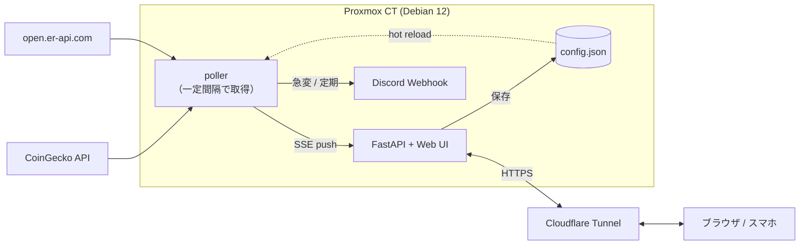

<div align="center">

# 🥔 poteto-monitor

**暗号資産 & 為替を、リアルタイムに。**

設定ファイル 1 つで好きな銘柄・通貨ペアを追加でき、ブラウザのライブダッシュボードと
Discord 通知で見守る、軽量なセルフホスト・モニターです。

<p>
  
  
  
  
  
</p>

</div>

---

## ✨ 特長

| | |
|---|---|
| 🖥️ **ライブ Web ダッシュボード** | SSE で**遅延なし更新**。価格カード・変化率・ミニチャートがリアルタイムに動く |
| ⚙️ **UI から全部いじれる** | 銘柄の追加/削除・閾値・更新間隔・基準通貨をブラウザで編集 → **再起動なしで即反映** |
| 🪙 **暗号資産** | CoinGecko の任意銘柄を USD / JPY など複数通貨で表示 |
| 💱 **為替レート** | ドル円・ユーロ円など任意の法定通貨ペア（**API キー不要**） |
| 🚨 **アセット別アラート** | 「暗号資産は 10%、為替は 2%」のように個別閾値。Discord へ即通知 |
| ☁️ **Cloudflare Tunnel 対応** | ローカル待受 + トンネルで、ポート開放なしに外から安全に閲覧 |
| 🧩 **設定ファイル駆動** | すべて `config.json`。コードに触れず運用できる |

> **v2 → 現在** — 毎時バッチ（COBOL 的な放置運用😅）から、**常駐デーモン + ライブ UI** へ刷新。
> 旧 `python monitor.py` / 毎時タイマー運用も互換で残しています。

---

## 🖼️ ダッシュボード

```
┌──────────────────────────────────────────────────────────────┐
│ 🥔 poteto-monitor        ● ライブ接続中 · 更新 21:04（毎60秒）│
│                                          ↻ 更新   ⚙ 設定      │
├───────────────┬───────────────┬──────────────────────────────┤
│ 🟡 Bitcoin    │ 🔷 Ethereum   │ 💴 ドル円 (USD/JPY)          │
│ $103,240.00   │ $3,842.00     │ ¥157.23 / 1 USD              │
│ ▲ +1.23%      │ ▼ -0.05%      │ ▲ +0.34%                     │
│ ╱╲╱‾╲╱ (spark)│ ╲╱╲╱╲ (spark) │ ╱‾╲╱╱ (spark)                │
└───────────────┴───────────────┴──────────────────────────────┘
```

「⚙ 設定」から銘柄・閾値・更新間隔・基準通貨・Webhook をその場で編集して保存できます。

---

## 🏗️ 構成



```
poteto-monitor/
├── poteto_monitor/
│   ├── config.py          # 設定の読み込み・検証・生 JSON 入出力
│   ├── providers.py       # 取得（crypto=CoinGecko / forex=open.er-api.com）
│   ├── notify.py          # Discord embed 生成・送信
│   ├── format.py          # 通貨・レート・変化率の整形
│   ├── storage.py         # prices.json / history.json（アトミック保存）
│   ├── monitor.py         # CLI（run / serve）
│   └── web/               # ★ ライブダッシュボード
│       ├── server.py      #   FastAPI（API + SSE + 静的配信）
│       ├── poller.py      #   バックグラウンド取得ループ
│       ├── state.py       #   ライブ状態 + SSE pub/sub
│       ├── context.py     #   設定ホットリロード
│       └── static/        #   単一ページ UI（依存ゼロ・self-contained）
├── config.example.json
├── pyproject.toml         # console script: poteto-monitor
├── poteto-monitor-web.service   # 常駐（Web + 通知）← 既定
├── poteto-monitor.service/.timer# 毎時1回モード（Web 不要な人向け）
├── install.sh
└── tests/                 # pytest（ネットワークはモック）
```

---

## 🚀 セットアップ（Proxmox CT / Debian 12）

```bash
# 1. 取得
apt-get install -y git sudo
git clone https://github.com/Poteto-Groove/poteto-monitor.git
cd poteto-monitor

# 2. インストール（専用ユーザー作成・venv・常駐サービス有効化まで）
chmod +x install.sh
sudo ./install.sh

# 3. 設定（Webhook と監視銘柄）
sudo nano /var/lib/poteto-monitor/config.json
sudo systemctl restart poteto-monitor-web.service

# 4. 動作確認
sudo systemctl status poteto-monitor-web.service
sudo -u poteto /opt/poteto-monitor/venv/bin/poteto-monitor --dry-run   # 取得だけ試す
```

インストール後、ダッシュボードは既定で `http://127.0.0.1:8787` で待ち受けます。

---

## ☁️ Cloudflare Tunnel で公開

ローカル（`127.0.0.1`）で待ち受けたダッシュボードを、ポート開放なしで安全に外へ出せます。

```bash
# cloudflared 導入後
cloudflared tunnel login
cloudflared tunnel create poteto
```

```yaml
# ~/.cloudflared/config.yml
tunnel: poteto
credentials-file: /root/.cloudflared/<TUNNEL_ID>.json
ingress:
  - hostname: monitor.example.com
    service: http://127.0.0.1:8787
  - service: http_status:404
```

```bash
cloudflared tunnel route dns poteto monitor.example.com
cloudflared tunnel run poteto        # 常用は systemd 化推奨
```

> 🔒 **公開時のセキュリティ** — 設定 API は銘柄や Webhook を編集できます。次のどちらかで必ず保護してください。
> - **推奨**: [Cloudflare Access](https://developers.cloudflare.com/cloudflare-one/policies/access/) をトンネル前段に置く
> - **簡易**: `config.json` の `web.auth_token`（または `WEB_AUTH_TOKEN`）を設定すると、UI/設定 API にトークンが必要になります

---

## ⚙️ 設定リファレンス（`config.json`）

| キー | 既定 | 説明 |
|---|---|---|
| `webhook_url` | — | Discord Webhook URL（未設定でも Web ダッシュボードは動作） |
| `alert_threshold` | `10` | 既定のアラート閾値（%）。アセット側で上書き可 |
| `base_currency` | `"usd"` | 変化率の基準通貨 |
| `poll_interval` | `60` | 取得間隔（秒, 最小 5）。**UI の更新頻度**に直結 |
| `report_interval` | `3600` | Discord 定期レポート間隔（秒, `0` で無効） |
| `history_limit` | `168` | `history.json` に残す件数 |
| `web.host` / `web.port` | `127.0.0.1` / `8787` | ダッシュボードの待受 |
| `web.auth_token` | `""` | 設定すると UI/設定 API に認証を要求 |
| `watch` | BTC/ETH/ドル円 | 監視対象リスト（下記） |

**`watch` — 暗号資産 (`type: "crypto"`)**

| キー | 必須 | 説明 |
|---|---|---|
| `id` | ✅ | CoinGecko の ID（`bitcoin`, `ethereum`, `solana` …）|
| `vs` | | 表示通貨の配列（既定 `["usd","jpy"]`）|
| `label` / `emoji` / `threshold` | | 表示名・絵文字・個別閾値 |

**`watch` — 為替 (`type: "forex"`)**

| キー | 必須 | 説明 |
|---|---|---|
| `base` / `quote` | ✅ | 通貨ペア（`USD` / `JPY`）。`"pair": "USD/JPY"` 形式も可 |
| `label` / `emoji` / `threshold` | | 表示名・絵文字・個別閾値 |

> 銘柄 ID は CoinGecko [`/coins/list`](https://api.coingecko.com/api/v3/coins/list) で確認。
> 為替は [open.er-api.com](https://www.exchangerate-api.com/docs/free)（キー不要）を使用。

### 環境変数での上書き

`DISCORD_WEBHOOK_URL` / `ALERT_THRESHOLD` / `BASE_CURRENCY` / `POLL_INTERVAL` /
`WEB_HOST` / `WEB_PORT` / `WEB_AUTH_TOKEN` / `POTETO_DATA_DIR`

---

## 🕒 通知だけ欲しい人向け（Web 不要モード）

ダッシュボードを使わず、毎時 1 回 Discord に投げるだけの軽量運用も可能です。

```bash
sudo systemctl disable --now poteto-monitor-web.service
sudo systemctl enable --now poteto-monitor.timer   # 毎時 poteto-monitor を実行
```

---

## 🧪 開発

```bash
pip install -e ".[dev]"
pytest                       # 単体テスト（ネットワーク・ファイルはモック）
poteto-monitor serve         # ローカルで http://127.0.0.1:8787
poteto-monitor --dry-run     # 1 回だけ取得して表示
```

| 実行形態 | コマンド |
|---|---|
| 常駐（Web + 通知） | `poteto-monitor serve` |
| 1 回だけ実行 | `poteto-monitor` / `poteto-monitor run` |
| 取得だけ（送信・保存なし） | `poteto-monitor --dry-run` |

---

## ⚠️ 「リアルタイム」について

ブラウザ側は SSE で**サーバーが新しい値を得た瞬間に**更新されます（描画の遅延なし）。
一方でデータ自体の鮮度は上流 API（CoinGecko / 為替）の更新頻度とレート制限に依存します。
`poll_interval` を短くするほど追随しますが、無料 API のレート制限に注意してください
（最小 5 秒。CoinGecko 無料枠は概ね毎分数十リクエストが目安）。

---

## 📝 あとがき

最近 ETH の動向を確認する機会が増えていて、友人も見られたら良いね、と作った小さなツールでした。

気付けば銀行の COBOL のように、コミュニティで誰にもメンテされないまま静かに動き続けていました。
今回はそれを掘り起こし、**通貨を自由に足せて・ドル円などの為替も見られて・ブラウザでリアルタイムに眺められる**
ように作り直しました。スタックも README もモダンに。

- 皆様と自分の幸運を祈っております 🥔

<div align="center"><sub>MIT License · Made for a small community that just wanted to watch the charts together.</sub></div>
