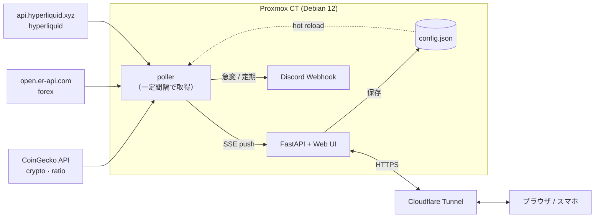

<div align="center">

# 🥔 poteto-monitor

**暗号資産 & 為替を、リアルタイムに。**

設定ファイル 1 つで好きな銘柄・通貨ペアを追加でき、ブラウザのライブダッシュボードと
Discord 通知で見守る、軽量なセルフホスト・モニターです。

<p>
  
  
  
  
  
</p>

</div>

---

## ✨ 特長

| | |
|---|---|
| 🖥️ **ライブ Web ダッシュボード** | SSE で**遅延なし更新**。価格カード・変化率・ミニチャートがリアルタイムに動く |
| ⚙️ **UI から全部いじれる** | 銘柄の追加/削除・閾値・更新間隔・基準通貨をブラウザで編集 → **再起動なしで即反映** |
| 🪙 **暗号資産** | CoinGecko の任意銘柄を USD / JPY など複数通貨で表示 |
| 💱 **為替レート** | ドル円・ユーロ円など任意の法定通貨ペア（**API キー不要**） |
| ⚡ **Hyperliquid** | `HYPE` や BTC/ETH などの **perp 板中値 (mid)** を監視（**API キー不要**） |
| 🪙 **ステーブル & レート比** | USDC / JPYC などのステーブルコイン、`ratio` 型で **JPYC/USDC** の比も算出 |
| 🚨 **アセット別アラート** | 「暗号資産は 10%、為替は 2%」のように個別閾値。Discord へ即通知 |
| ☁️ **Cloudflare Tunnel 対応** | ローカル待受 + トンネルで、ポート開放なしに外から安全に閲覧 |
| 🧩 **プラグイン式プロバイダ** | 種別ごとの取得関数を **レジストリに 1 行登録**するだけ。新データソースを見越した拡張構造 |

> **v2 → 現在** — 毎時バッチ（COBOL 的な放置運用😅）から、**常駐デーモン + ライブ UI** へ刷新。
> 旧 `python monitor.py` / 毎時タイマー運用も互換で残しています。

---

## 🖼️ ダッシュボード

```
┌──────────────────────────────────────────────────────────────┐
│ 🥔 poteto-monitor        ● ライブ接続中 · 更新 21:04（毎60秒）│
│                                          ↻ 更新   ⚙ 設定      │
├───────────────┬───────────────┬──────────────────────────────┤
│ 🟡 Bitcoin    │ 🔷 Ethereum   │ 💴 ドル円 (USD/JPY)          │
│ $103,240.00   │ $3,842.00     │ ¥157.23 / 1 USD              │
│ ▲ +1.23%      │ ▼ -0.05%      │ ▲ +0.34%                     │
│ ╱╲╱‾╲╱ (spark)│ ╲╱╲╱╲ (spark) │ ╱‾╲╱╱ (spark)                │
└───────────────┴───────────────┴──────────────────────────────┘
```

「⚙ 設定」から銘柄・閾値・更新間隔・基準通貨・Webhook をその場で編集して保存できます。

---

## 🏗️ 構成


```mermaid
flowchart LR
    subgraph CT["Proxmox CT (Debian 12)"]
        P["poller<br/>（一定間隔で取得）"] -->|SSE push| W["FastAPI + Web UI"]
        P -->|急変 / 定期| D["Discord Webhook"]
        C[("config.json")] -. hot reload .-> P
        W -->|保存| C
    end
    CG["CoinGecko API<br/>crypto · ratio"] --> P
    FX["open.er-api.com<br/>forex"] --> P
    HL["api.hyperliquid.xyz<br/>hyperliquid"] --> P
    W <-->|HTTPS| CFT["Cloudflare Tunnel"] <--> U["ブラウザ / スマホ"]
```

```
poteto-monitor/
├── poteto_monitor/
│   ├── config.py          # 設定の読み込み・検証・生 JSON 入出力
│   ├── providers.py       # 取得プロバイダのレジストリ（crypto / forex / hyperliquid / ratio）
│   ├── notify.py          # Discord embed 生成・送信
│   ├── format.py          # 通貨・レート・変化率の整形
│   ├── storage.py         # prices.json / history.json（アトミック保存）
│   ├── monitor.py         # CLI（run / serve）
│   └── web/               # ★ ライブダッシュボード
│       ├── server.py      #   FastAPI（API + SSE + 静的配信）
│       ├── poller.py      #   バックグラウンド取得ループ
│       ├── state.py       #   ライブ状態 + SSE pub/sub
│       ├── context.py     #   設定ホットリロード
│       └── static/        #   単一ページ UI（依存ゼロ・self-contained）
├── config.example.json
├── pyproject.toml         # console script: poteto-monitor
├── poteto-monitor-web.service   # 常駐（Web + 通知）← 既定
├── poteto-monitor.service/.timer# 毎時1回モード（Web 不要な人向け）
├── install.sh
└── tests/                 # pytest（ネットワークはモック）
```

---

## 🚀 セットアップ（Proxmox CT / Debian 12）

```bash
# 1. 取得
apt-get install -y git sudo
git clone https://github.com/Poteto-Groove/poteto-monitor.git
cd poteto-monitor

# 2. インストール（専用ユーザー作成・venv・常駐サービス有効化まで）
chmod +x install.sh
sudo ./install.sh

# 3. 設定（Webhook と監視銘柄）
sudo nano /var/lib/poteto-monitor/config.json
sudo systemctl restart poteto-monitor-web.service

# 4. 動作確認
sudo systemctl status poteto-monitor-web.service
sudo -u poteto /opt/poteto-monitor/venv/bin/poteto-monitor --dry-run   # 取得だけ試す
```

インストール後、ダッシュボードは既定で `http://127.0.0.1:8787` で待ち受けます。

---

## ☁️ Cloudflare Tunnel で公開

ローカル（`127.0.0.1`）で待ち受けたダッシュボードを、ポート開放なしで安全に外へ出せます。

```bash
# cloudflared 導入後
cloudflared tunnel login
cloudflared tunnel create poteto
```

```yaml
# ~/.cloudflared/config.yml
tunnel: poteto
credentials-file: /root/.cloudflared/<TUNNEL_ID>.json
ingress:
  - hostname: monitor.example.com
    service: http://127.0.0.1:8787
  - service: http_status:404
```

```bash
cloudflared tunnel route dns poteto monitor.example.com
cloudflared tunnel run poteto        # 常用は systemd 化推奨
```

> 🔒 **公開時のセキュリティ** — 設定 API は銘柄や Webhook を編集できます。次のどちらかで必ず保護してください。
> - **推奨**: [Cloudflare Access](https://developers.cloudflare.com/cloudflare-one/policies/access/) をトンネル前段に置く
> - **簡易**: `config.json` の `web.auth_token`（または `WEB_AUTH_TOKEN`）を設定すると、UI/設定 API にトークンが必要になります

---

## ⚙️ 設定リファレンス（`config.json`）

| キー | 既定 | 説明 |
|---|---|---|
| `webhook_url` | — | Discord Webhook URL（未設定でも Web ダッシュボードは動作） |
| `alert_threshold` | `10` | 既定のアラート閾値（%）。アセット側で上書き可 |
| `base_currency` | `"usd"` | 変化率の基準通貨 |
| `poll_interval` | `60` | 取得間隔（秒, 最小 5）。**UI の更新頻度**に直結 |
| `intervals` | `{"coingecko": 300, "forex": 3600, "hyperliquid": 0}` | 常駐モードでのデータソースごとの最短取得間隔（秒）。`0` は毎回の poll で取得。為替は上流の次回更新時刻（1 日 1 回）まで再取得しません |
| `report_interval` | `3600` | Discord 定期レポート間隔（秒, `0` で無効） |
| `retention_days` | `30` | 履歴 DB（`history.db`）に残す日数。旧 `history_limit` は無視されます |
| `alert_window` | `3600` | 急変アラートの比較期間（秒, 最小 60）。この秒数前の値と比べて閾値を超えたら通知 |
| `alert_cooldown` | `3600` | 同じ銘柄のアラートを再送しない時間（秒）。再起動しても引き継ぎます |
| `web.host` / `web.port` | `127.0.0.1` / `8787` | ダッシュボードの待受 |
| `web.auth_token` | `""` | 設定すると UI/設定 API に認証を要求 |
| `watch` | BTC/ETH/ドル円 | 監視対象リスト（下記） |

**`watch` — 暗号資産 (`type: "crypto"`)**

| キー | 必須 | 説明 |
|---|---|---|
| `id` | ✅ | CoinGecko の ID（`bitcoin`, `ethereum`, `solana` …）|
| `vs` | | 表示通貨の配列（既定 `["usd","jpy"]`）|
| `label` / `emoji` / `threshold` | | 表示名・絵文字・個別閾値 |

**`watch` — 為替 (`type: "forex"`)**

| キー | 必須 | 説明 |
|---|---|---|
| `base` / `quote` | ✅ | 通貨ペア（`USD` / `JPY`）。`"pair": "USD/JPY"` 形式も可 |
| `label` / `emoji` / `threshold` | | 表示名・絵文字・個別閾値 |

**`watch` — Hyperliquid (`type: "hyperliquid"`)**

| キー | 必須 | 説明 |
|---|---|---|
| `coin` | ✅ | Hyperliquid の銘柄シンボル（`HYPE`, `BTC`, `ETH`, `SOL` …）。**perp 板中値 (mid, USD 建て)** |
| `label` / `emoji` / `threshold` | | 表示名・絵文字・個別閾値 |

```json
{ "type": "hyperliquid", "coin": "HYPE", "label": "HYPE", "emoji": "⚡" }
```

**`watch` — レート比 (`type: "ratio"`)**

2 銘柄の価格比を算出します。ステーブルコイン同士（`JPYC/USDC`）や、任意の相対強弱（`HYPE/BTC` 等）に。

| キー | 必須 | 説明 |
|---|---|---|
| `num` / `den` | ✅ | 分子 / 分母の CoinGecko ID。`"pair": "jpyc/usd-coin"` 形式も可。値 = `price(num)/price(den)` |
| `label` / `emoji` / `threshold` | | 表示名・絵文字・個別閾値 |

```json
{ "type": "ratio", "num": "jpyc", "den": "usd-coin", "label": "JPYC/USDC", "emoji": "🪙" }
```

> 銘柄 ID は CoinGecko [`/coins/list`](https://api.coingecko.com/api/v3/coins/list) で確認（例: `usd-coin`, `jpyc`）。
> 為替は [open.er-api.com](https://www.exchangerate-api.com/docs/free)、Hyperliquid は [公開 info API](https://hyperliquid.gitbook.io/hyperliquid-docs/for-developers/api)（いずれもキー不要）。

### 🧩 新しいデータソースを足す

データソースは `poteto_monitor/providers.py` の `SOURCES` レジストリに登録された関数です。
1 つのソースは複数の `type` を受け持てます（CoinGecko は `crypto` と `ratio` を 1 リクエストで取得）。
新しいソース（別の DEX、株価 API など）を足すには、同じシグネチャの関数を書いて 1 行登録するだけ:

```python
def fetch_mydex(assets, base_currency, *, session=None, api_key="") -> SourceResult:
    ...  # 取得して SourceResult(readings=[...], errors={key: 理由}) を返す

SOURCES["mydex"] = Source(types=("mydex",), fetch=fetch_mydex)  # config の {"type": "mydex", ...} が有効に
```

銘柄単位の失敗（ID の打ち間違いなど）は `errors` に入れて返し、リクエスト自体の失敗だけを例外にします。
常駐モードではソースごとに失敗が切り分けられ、取得できない銘柄は前回の値を「取得失敗」と分かる表示で残します。

### 環境変数での上書き

`DISCORD_WEBHOOK_URL` / `ALERT_THRESHOLD` / `BASE_CURRENCY` / `POLL_INTERVAL` /
`WEB_HOST` / `WEB_PORT` / `WEB_AUTH_TOKEN` / `POTETO_DATA_DIR`

### 📈 履歴とヘルスチェック

取得できた値は `/var/lib/poteto-monitor/history.db`（SQLite, 権限 600）に記録され、次に使われます。

- **急変アラート**: `alert_window` 秒前の値と比較（既定は 1 時間前比）。`alert_cooldown` の間は同じ銘柄を再通知しません
- **定期レポート**: 前回レポート時点の値と比較。送信時刻も記録するので、再起動しても間隔内には再送しません
- **ダッシュボード**: カードに 24 時間変化率を表示。カードをクリックすると 24 時間 / 7 日のチャート
- **データソース障害**: 取得失敗が 10 分続くと Discord に通知し、復旧時にも通知します

`GET /healthz` はポーラーが動いていて全データソースの直近の取得が成功していれば `200`、そうでなければ `503` を返します（Uptime Kuma の HTTP 監視向け）。
`GET /api/history?range=24h|7d[&key=...]` で時系列を取得できます。

旧形式の `history.json`（v1 / v2）は次のコマンドで取り込めます（重複は無視）:

```bash
sudo -u poteto /opt/poteto-monitor/venv/bin/poteto-monitor import-history /var/lib/poteto-monitor/history.json
```

`COINGECKO_API_KEY` を設定すると CoinGecko の [Demo キー](https://www.coingecko.com/en/api/pricing)
（`x-cg-demo-api-key`）を使います。キーは環境変数からのみ読み込み、`config.json` や UI には保存しません。
systemd で使う場合は `systemctl edit poteto-monitor-web` で `Environment=` を追加するか、
`EnvironmentFile=` で権限 600 のファイルを指定してください。

---

## 🕒 通知だけ欲しい人向け（Web 不要モード）

ダッシュボードを使わず、毎時 1 回 Discord に投げるだけの軽量運用も可能です。

```bash
sudo systemctl disable --now poteto-monitor-web.service
sudo systemctl enable --now poteto-monitor.timer   # 毎時 poteto-monitor を実行
```

---

## 🧪 開発

```bash
pip install -e ".[dev]"
pytest                       # 単体テスト（ネットワーク・ファイルはモック）
poteto-monitor serve         # ローカルで http://127.0.0.1:8787
poteto-monitor --dry-run     # 1 回だけ取得して表示
```

| 実行形態 | コマンド |
|---|---|
| 常駐（Web + 通知） | `poteto-monitor serve` |
| 1 回だけ実行 | `poteto-monitor` / `poteto-monitor run` |
| 取得だけ（送信・保存なし） | `poteto-monitor --dry-run` |

---

## ⚠️ 「リアルタイム」について

ブラウザ側は SSE で**サーバーが新しい値を得た瞬間に**更新されます（描画の遅延なし）。
一方でデータ自体の鮮度は上流 API の更新頻度とレート制限に依存するため、
常駐モードではデータソースごとに取得間隔（`intervals`）を分けています。

| ソース | 既定の間隔 | 理由 |
|---|---|---|
| Hyperliquid | 毎回の poll | 公開 API の上限が十分大きい（REST 合計で毎分 1,200 の重み、`allMids` は 2） |
| CoinGecko | 300 秒 | キーなしは毎分 10〜30 回程度で変動。Demo キーも月 10,000 回までのため、約 260 秒以上の間隔が必要 |
| 為替 | 上流の次回更新まで | open.er-api.com は 1 日 1 回更新。制限超過時は 429 が 20 分続く |

「今すぐ更新」ボタンもこの間隔を超えては取得しません（10 秒に 1 回まで）。
BTC / ETH などを高頻度で見たい場合は `type: "hyperliquid"` を使うのがおすすめです
（perp の板中値なので、現物価格とは少しずれます）。

---

## 📝 あとがき

最近 ETH の動向を確認する機会が増えていて、友人も見られたら良いね、と作った小さなツールでした。

気付けば銀行の COBOL のように、コミュニティで誰にもメンテされないまま静かに動き続けていました。
今回はそれを掘り起こし、**通貨を自由に足せて・ドル円などの為替も見られて・ブラウザでリアルタイムに眺められる**
ように作り直しました。スタックも README もモダンに。

- 皆様と自分たちの幸運を祈っております 🥔

<div align="center"><sub>MIT License · Made for a small community that just wanted to watch the charts together.</sub></div>
